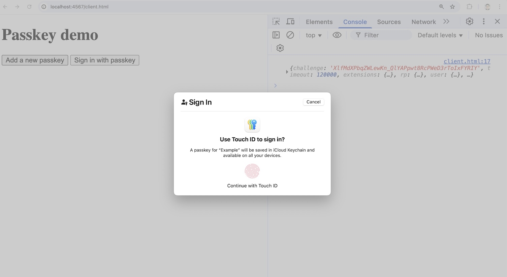

# Passkey minimal implementation

This app is a demonstration of how to implement passkeys with the minimum amount of code. It consists of only two files:

- [client.html](public/client.html)
- [relying_party.rb](relying_party.rb)

Each file is less than 100 lines of code. The goal of this repository is not to provide a complete reference for passkeys, but rather to give someone new to passkeys a high level understanding of what kind of code is necessary for implementation.



## Installation

The [relying_party.rb](relying_party.rb) backend requires the Ruby programming language with the following gems installed:

```bash
gem install sinatra
gem install sinatra/contrib
gem install webauthn
gem install sqlite3
```

The [client.html](public/client.html) frontend doesn't use any external libraries, but it does require a browser that has [passkey support](https://caniuse.com/passkeys).

## Usage

Start the server:

```bash
ruby relying_party.rb
```

Open the browser to http://localhost:4567/client.html

First click the "Add a passkey" button to add a passkey.

Then click the "Sign in with passkey" button to sign in with the passkey you created.

Note:

- Modifying the code requires restarting the server to see the changes.
- If you want the server to automatically reload with each file change, you can install the `rerun` gem (`gem install rerun`) and run the server using the command `rerun 'ruby relying_party.rb'`.
